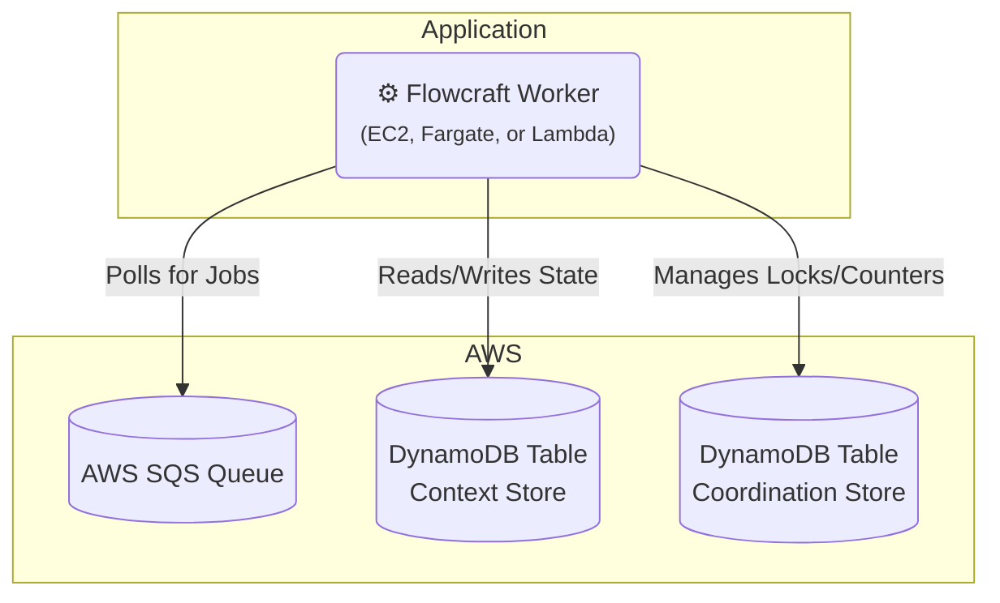

# Runtime Adapter: AWS (SQS & DynamoDB)

[](https://www.npmjs.com/package/@flowcraft/sqs-adapter)

This adapter provides a fully native, serverless-friendly solution for running distributed workflows on Amazon Web Services. It uses **AWS SQS** for reliable job queuing and **AWS DynamoDB** for scalable state persistence and coordination, eliminating the need for a separate Redis instance.

## Installation

You will need the adapter and the required AWS SDK v3 modules.

```bash
npm install flowcraft @flowcraft/sqs-adapter @aws-sdk/client-sqs @aws-sdk/client-dynamodb @aws-sdk/util-dynamodb
```

## Architecture

This adapter leverages native AWS services for all distributed concerns.



## Infrastructure Setup

You must have the following AWS resources provisioned:
-   An **SQS Queue** to handle jobs.
-   Three **DynamoDB Tables**:
    1.  For workflow **context** (Primary Key: `runId`).
    2.  For workflow **status** (Primary Key: `runId`).
    3.  For **coordination** (Primary Key: `key`). This table should have TTL enabled on a `ttl` attribute for automatic cleanup of locks.

### Using AWS CLI

```bash
# 1. Create SQS Queue
aws sqs create-queue --queue-name flowcraft-jobs

# 2. Create DynamoDB Tables
aws dynamodb create-table --table-name flowcraft-contexts --attribute-definitions AttributeName=runId,AttributeType=S --key-schema AttributeName=runId,KeyType=HASH --billing-mode PAY_PER_REQUEST
aws dynamodb create-table --table-name flowcraft-statuses --attribute-definitions AttributeName=runId,AttributeType=S --key-schema AttributeName=runId,KeyType=HASH --billing-mode PAY_PER_REQUEST
aws dynamodb create-table --table-name flowcraft-coordination --attribute-definitions AttributeName=key,AttributeType=S --key-schema AttributeName=key,KeyType=HASH --billing-mode PAY_PER_REQUEST

# 3. Enable TTL on the coordination table
aws dynamodb update-time-to-live --table-name flowcraft-coordination --time-to-live-specification "Enabled=true, AttributeName=ttl"
```

### Using Terraform

```hcl
resource "aws_sqs_queue" "jobs" {
  name = "flowcraft-jobs"
}

resource "aws_dynamodb_table" "contexts" {
  name         = "flowcraft-contexts"
  billing_mode = "PAY_PER_REQUEST"
  hash_key     = "runId"
  attribute {
    name = "runId"
    type = "S"
  }
}

resource "aws_dynamodb_table" "statuses" {
  name         = "flowcraft-statuses"
  billing_mode = "PAY_PER_REQUEST"
  hash_key     = "runId"
  attribute {
    name = "runId"
    type = "S"
  }
}

resource "aws_dynamodb_table" "coordination" {
  name         = "flowcraft-coordination"
  billing_mode = "PAY_PER_REQUEST"
  hash_key     = "key"
  attribute {
    name = "key"
    type = "S"
  }
  ttl {
    attribute_name = "ttl"
    enabled        = true
  }
}
```

## Worker Usage

The following example shows how to set up and start a worker that processes jobs from SQS.

```typescript
import { DynamoDBClient } from '@aws-sdk/client-dynamodb'
import { SQSClient } from '@aws-sdk/client-sqs'
import { DynamoDbCoordinationStore, SqsAdapter } from '@flowcraft/sqs-adapter'
import { FlowRuntime } from 'flowcraft'

// 1. Define your workflow blueprints and node implementations
const blueprints = { /* your workflow blueprints */ }
const registry = { /* your node implementations */ }

// 2. Initialize AWS service clients
const awsConfig = { region: process.env.AWS_REGION || 'us-east-1' }
const sqsClient = new SQSClient(awsConfig)
const dynamoDbClient = new DynamoDBClient(awsConfig)

// 3. Create a runtime instance
const runtime = new FlowRuntime({ blueprints, registry })

// 4. Set up the coordination store using DynamoDB
const coordinationStore = new DynamoDbCoordinationStore({
  client: dynamoDbClient,
  tableName: 'flowcraft-coordination',
})

// 5. Initialize the adapter
const adapter = new SqsAdapter({
  runtimeOptions: runtime.options,
  coordinationStore,
  sqsClient,
  dynamoDbClient,
  queueUrl: process.env.SQS_QUEUE_URL,
  contextTableName: 'flowcraft-contexts',
  statusTableName: 'flowcraft-statuses',
})

// 6. Start the worker to begin polling the SQS queue
adapter.start()

console.log('Flowcraft worker with SQS adapter is running...')
```

## Starting a Workflow (Client-Side)

A client starts a workflow by setting the initial state in DynamoDB and sending the first job(s) to SQS.

```typescript
import { analyzeBlueprint } from 'flowcraft'
import { DynamoDBClient } from '@aws-sdk/client-dynamodb'
import { SQSClient, SendMessageBatchCommand } from '@aws-sdk/client-sqs'
import { DynamoDBDocumentClient, PutCommand } from '@aws-sdk/lib-dynamodb'

async function startWorkflow(blueprint, initialContext) {
  const runId = crypto.randomUUID()
  const awsConfig = { region: process.env.AWS_REGION }
  const sqsClient = new SQSClient(awsConfig)
  const docClient = DynamoDBDocumentClient.from(new DynamoDBClient(awsConfig))

  // 1. Set initial context and status in DynamoDB
  await docClient.send(new PutCommand({
    TableName: 'flowcraft-contexts',
    Item: { runId, context: initialContext },
  }))
  await docClient.send(new PutCommand({
    TableName: 'flowcraft-statuses',
    Item: { runId, status: 'running', lastUpdated: new Date().toISOString() },
  }))

  // 2. Analyze blueprint for start nodes
  const analysis = analyzeBlueprint(blueprint)
  const startJobs = analysis.startNodeIds.map(nodeId => ({
    Id: `${runId}-${nodeId}`,
    MessageBody: JSON.stringify({ runId, blueprintId: blueprint.id, nodeId }),
  }))

  // 3. Enqueue start jobs to SQS
  await sqsClient.send(new SendMessageBatchCommand({
    QueueUrl: process.env.SQS_QUEUE_URL,
    Entries: startJobs,
  }))

  console.log(`Workflow ${runId} started.`)
  return runId
}
```

## Reconciliation

The adapter includes a utility to find and resume stalled workflows, which is essential for ensuring reliability.

### How It Works

The reconciler queries the DynamoDB status table for workflows that are in a 'running' state but have not been updated recently. For each stalled run, it re-enqueues the next valid jobs.

### Usage

```typescript
import { createSqsReconciler } from '@flowcraft/sqs-adapter'

// 'adapter' and 'dynamoDbClient' should be initialized as in the worker setup
const reconciler = createSqsReconciler({
  adapter,
  dynamoDbClient,
  statusTableName: 'flowcraft-statuses',
  stalledThresholdSeconds: 300, // 5 minutes
})

// Run this function periodically
async function reconcile() {
  const stats = await reconciler.run()
  console.log(`Scanned ${stats.scannedItems} items, reconciled ${stats.reconciledRuns} runs.`)
}
```

## Key Components

- **`SqsAdapter`**: The main class that polls SQS and orchestrates job execution.
- **`DynamoDbContext`**: An `IAsyncContext` implementation for storing state in DynamoDB.
- **`DynamoDbCoordinationStore`**: A Redis-free `ICoordinationStore` implementation using DynamoDB's atomic operations.
- **`createSqsReconciler`**: A factory function to create the workflow reconciliation utility.
