# Runtime Adapter: AWS (SQS & DynamoDB)

[](https://www.npmjs.com/package/@flowcraft/sqs-adapter)

The AWS adapter provides a fully native, serverless-friendly solution for running distributed workflows on Amazon Web Services. It uses **SQS** for job queuing and **DynamoDB** for both the context store and the coordination store.

This is an excellent choice for applications already deployed on AWS, as it requires no additional infrastructure management.

## Installation

You will need the adapter package and the relevant AWS SDK v3 clients.

```bash
npm install @flowcraft/sqs-adapter @aws-sdk/client-sqs @aws-sdk/client-dynamodb @aws-sdk/util-dynamodb
```

## Infrastructure Setup

Before running the adapter, you need to provision the following AWS resources:

- **SQS Queue**: A standard queue for job messages.
- **DynamoDB Tables**: Three tables for context storage, status tracking, and coordination.

### Using AWS CLI

1. Create the SQS queue:
```bash
aws sqs create-queue --queue-name flowcraft-jobs
```

2. Create the DynamoDB tables:
```bash
# Contexts table
aws dynamodb create-table \
  --table-name flowcraft-contexts \
  --attribute-definitions AttributeName=runId,AttributeType=S \
  --key-schema AttributeName=runId,KeyType=HASH \
  --billing-mode PAY_PER_REQUEST

# Statuses table
aws dynamodb create-table \
  --table-name flowcraft-statuses \
  --attribute-definitions AttributeName=runId,AttributeType=S \
  --key-schema AttributeName=runId,KeyType=HASH \
  --billing-mode PAY_PER_REQUEST

# Coordination table
aws dynamodb create-table \
  --table-name flowcraft-coordination \
  --attribute-definitions AttributeName=key,AttributeType=S \
  --key-schema AttributeName=key,KeyType=HASH \
  --billing-mode PAY_PER_REQUEST
```

3. Get the queue URL for your worker configuration:
```bash
aws sqs get-queue-url --queue-name flowcraft-jobs --output text
```

### Using Terraform

```hcl
resource "aws_sqs_queue" "flowcraft_jobs" {
  name = "flowcraft-jobs"
}

resource "aws_dynamodb_table" "flowcraft_contexts" {
  name         = "flowcraft-contexts"
  billing_mode = "PAY_PER_REQUEST"
  hash_key     = "runId"

  attribute {
    name = "runId"
    type = "S"
  }
}

resource "aws_dynamodb_table" "flowcraft_statuses" {
  name         = "flowcraft-statuses"
  billing_mode = "PAY_PER_REQUEST"
  hash_key     = "runId"

  attribute {
    name = "runId"
    type = "S"
  }
}

resource "aws_dynamodb_table" "flowcraft_coordination" {
  name         = "flowcraft-coordination"
  billing_mode = "PAY_PER_REQUEST"
  hash_key     = "key"

  attribute {
    name = "key"
    type = "S"
  }
}
```

## Architecture

This adapter leverages native AWS services for all distributed concerns.

```mermaid
graph TD
    subgraph "Application"
        Worker("⚙️ Flowcraft Worker<br><small>(EC2, Fargate, or Lambda)</small>")
    end

    subgraph "AWS"
        Queue[("AWS SQS Queue")]
        State[("DynamoDB Table<br>Context Store")]
        Coordination[("DynamoDB Table<br>Coordination Store")]
    end

    Worker -- "Polls for Jobs" --> Queue
    Worker -- "Reads/Writes State" --> State
    Worker -- "Manages Locks/Counters" --> Coordination
```



## Usage

The following example shows how to configure and start a worker using the `SqsAdapter`.

#### `worker.ts`
```typescript
import { DynamoDBClient } from '@aws-sdk/client-dynamodb'
import { SQSClient } from '@aws-sdk/client-sqs'
import { DynamoDbCoordinationStore, SqsAdapter } from '@flowcraft/sqs-adapter'
// Assume agentNodeRegistry and blueprints are loaded from your application's shared files.
import { agentNodeRegistry, blueprints } from './shared'

async function main() {
	console.log('--- Starting Flowcraft Worker (AWS SQS/DynamoDB) ---')

	const region = process.env.AWS_REGION || 'us-east-1'

	// 1. Instantiate the AWS SDK clients.
	// In a real environment, credentials will be picked up automatically
	// from IAM roles or environment variables.
	const sqsClient = new SQSClient({ region })
	const dynamoDbClient = new DynamoDBClient({ region })

	// 2. Create the coordination store using DynamoDB for atomic operations.
	const coordinationStore = new DynamoDbCoordinationStore({
		client: dynamoDbClient,
		tableName: 'flowcraft-coordination', // You must create this table
	})

	// 3. Instantiate the adapter.
	const adapter = new SqsAdapter({
		sqsClient,
		dynamoDbClient,
		queueUrl: process.env.SQS_QUEUE_URL, // e.g., 'https://sqs.us-east-1.amazonaws.com/123456789012/flowcraft-jobs'
		contextTableName: 'flowcraft-contexts', // You must create this table
		statusTableName: 'flowcraft-statuses', // You must create this table
		coordinationStore,
		runtimeOptions: {
			registry: agentNodeRegistry,
			blueprints,
		},
	})

	// 4. Start the worker. It will begin long-polling SQS for jobs.
	adapter.start()

	console.log('Worker is running. Waiting for jobs...')
}

main().catch(console.error)
```

## Client Usage

Once your worker is running, you'll need a way to start workflows. The following example shows how to enqueue the initial jobs for a workflow using the SQS adapter.

#### `client.ts`
```typescript
import { DynamoDBClient } from '@aws-sdk/client-dynamodb'
import { SendMessageBatchCommand, SQSClient } from '@aws-sdk/client-sqs'
import { DynamoDbCoordinationStore } from '@flowcraft/sqs-adapter'
import type { WorkflowResult } from 'flowcraft'
import { analyzeBlueprint } from 'flowcraft'
// Assume blueprints and config are loaded from your application's shared files.
import { blueprints, config } from './shared'
import 'dotenv/config'

const ACTIVE_USE_CASE = '4.content-moderation'

export async function waitForWorkflow(
	dynamoDbClient: DynamoDBClient,
	statusTableName: string,
	runId: string,
	timeoutMs: number,
): Promise<{ status: string; payload?: WorkflowResult; reason?: string }> {
	const startTime = Date.now()

	console.log(`Awaiting result for Run ID ${runId} in table: ${statusTableName}`)

	while (Date.now() - startTime < timeoutMs) {
		try {
			const { DynamoDBDocumentClient, GetCommand } = await import('@aws-sdk/lib-dynamodb')
			const docClient = DynamoDBDocumentClient.from(dynamoDbClient)

			const response = await docClient.send(new GetCommand({
				TableName: statusTableName,
				Key: { runId },
			}))

			if (response.Item && response.Item.status !== 'running') {
				return {
					status: response.Item.status,
					payload: response.Item.status === 'completed' ? response.Item.result : undefined,
					reason: response.Item.reason,
				}
			}
		} catch (error) {
			console.error('Error checking workflow status:', error)
		}

		await new Promise((resolve) => setTimeout(resolve, 1000))
	}

	return {
		status: 'failed',
		reason: `Timeout: Client did not receive a result within ${timeoutMs}ms.`,
	}
}

async function main() {
	console.log('--- Distributed Workflow Client (AWS SQS/DynamoDB) ---')

	const region = process.env.AWS_REGION || 'us-east-1'
	const runId = Math.floor(Math.random() * 1000000).toString()

	// 1. Instantiate the AWS SDK clients (same as worker)
	const sqsClient = new SQSClient({ region })
	const dynamoDbClient = new DynamoDBClient({ region })

	// 2. Create the coordination store (needed for status tracking)
	const coordinationStore = new DynamoDbCoordinationStore({
		client: dynamoDbClient,
		tableName: 'flowcraft-coordination',
	})

	// 3. Get workflow configuration
	const useCase = config[ACTIVE_USE_CASE]
	const blueprint = blueprints[useCase.mainWorkflowId]

	const analysis = analyzeBlueprint(blueprint)
	const startNodeIds = analysis.startNodeIds
	const initialContextData = useCase.initialContext

	// 4. Set initial context in DynamoDB
	const { DynamoDBDocumentClient, PutCommand } = await import('@aws-sdk/lib-dynamodb')
	const docClient = DynamoDBDocumentClient.from(dynamoDbClient)

	await docClient.send(new PutCommand({
		TableName: 'flowcraft-contexts',
		Item: {
			runId,
			context: initialContextData,
			createdAt: new Date().toISOString(),
		},
	}))

	// 5. Initialize workflow status
	await docClient.send(new PutCommand({
		TableName: 'flowcraft-statuses',
		Item: {
			runId,
			status: 'running',
			lastUpdated: new Date().toISOString(),
		},
	}))

	// 6. Enqueue start jobs to SQS
	const startJobs = startNodeIds.map((nodeId: any) => ({
		Id: `${runId}-${nodeId}`,
		MessageBody: JSON.stringify({
			runId,
			blueprintId: useCase.mainWorkflowId,
			nodeId,
		}),
	}))

	const queueUrl = process.env.SQS_QUEUE_URL
	if (!queueUrl) {
		throw new Error('SQS_QUEUE_URL environment variable is required')
	}

	console.log(`🚀 Enqueuing ${startJobs.length} start job(s) for Run ID: ${runId}`)
	await sqsClient.send(new SendMessageBatchCommand({
		QueueUrl: queueUrl,
		Entries: startJobs,
	}))

	try {
		const finalStatus = await waitForWorkflow(dynamoDbClient, 'flowcraft-statuses', runId, 60000)
		console.log('\n=============================================================')

		switch (finalStatus.status) {
			case 'completed':
				console.log(`✅ Workflow Run ID: ${runId} COMPLETED.`)
				console.log('Final Output:', finalStatus.payload?.context?.moderation_result)
				break
			case 'cancelled':
				console.warn(`🛑 Workflow Run ID: ${runId} was successfully CANCELLED.`)
				console.log(`   Reason: ${finalStatus.reason}`)
				break
			case 'failed':
				console.error(`❌ Workflow Run ID: ${runId} FAILED or timed out.`)
				console.error(`   Reason: ${finalStatus.reason}`)
				break
		}
		console.log('=============================================================\n')
	} catch (error) {
		console.error(`Error waiting for workflow to complete for Run ID ${runId}`, error)
	}
}

main().catch(console.error)
```

This client example demonstrates how to:
- Set initial context data in DynamoDB
- Initialize workflow status tracking
- Enqueue the initial jobs to SQS to start workflow execution
- Wait for workflow completion by polling the status table

## Workflow Reconciliation

To enhance fault tolerance, the SQS adapter includes a utility for detecting and resuming stalled workflows. This is critical in production environments where workers might crash, leaving workflows in an incomplete state.

### How It Works

The reconciler queries the DynamoDB `statuses` table for workflows that have a `status` of 'running' but whose `lastUpdated` timestamp is older than a configurable threshold. For each stalled run, it safely re-enqueues the next set of executable nodes. The adapter automatically maintains the `lastUpdated` timestamp on the status item.

### Reconciler Usage

A reconciliation process should be run periodically as a separate script or scheduled job (e.g., a cron job or a scheduled AWS Lambda function).

#### `reconcile.ts`
```typescript
import { createSqsReconciler } from '@flowcraft/sqs-adapter';

// Assume 'adapter' and 'dynamoDbClient' are initialized just like in your worker
const reconciler = createSqsReconciler({
  adapter,
  dynamoDbClient,
  statusTableName: 'flowcraft-statuses',
  stalledThresholdSeconds: 300, // 5 minutes
});

async function runReconciliation() {
  console.log('Starting reconciliation cycle...');
  const stats = await reconciler.run();
  console.log(`Reconciliation complete. Scanned: ${stats.scannedItems}, Stalled: ${stats.stalledRuns}, Resumed: ${stats.reconciledRuns}, Failed: ${stats.failedRuns}`);
}

// Run this function on a schedule
runReconciliation();
```

The `run()` method returns a `ReconciliationStats` object:
-   `scannedItems`: Total number of items scanned in the DynamoDB status table.
-   `stalledRuns`: Number of workflows identified as stalled.
-   `reconciledRuns`: Number of workflows where at least one job was successfully re-enqueued.
-   `failedRuns`: Number of workflows where an error occurred during the reconciliation attempt.

## Key Components

-   **Job Queue**: Uses an AWS SQS queue. The adapter polls for messages and deletes them upon successful processing.
-   **Context Store**: The `DynamoDbContext` class stores the state for each workflow run as a single item in a DynamoDB table.
-   **Coordination Store**: The `DynamoDbCoordinationStore` is a powerful, Redis-free implementation that uses DynamoDB's atomic counters and conditional expressions to safely manage distributed locks and fan-in joins.
-   **Reconciler**: The `createSqsReconciler` factory provides a utility to find and resume stalled workflows.
