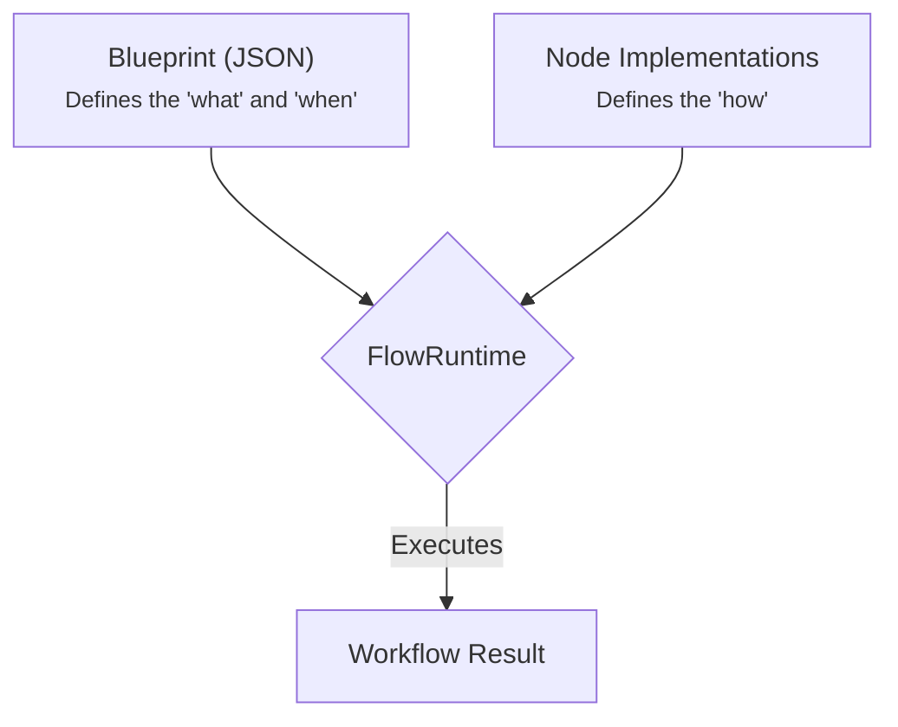

# Core Concepts

Flowcraft is built on a few simple but powerful concepts. Understanding them is key to building effective workflows. You can also review the [API Reference Overview](/api/) for more technical details.

## Workflow Blueprint

A [`WorkflowBlueprint`](/api/flow#workflowblueprint-interface) is a JSON-serializable object that declaratively defines your workflow's structure. It's the "data" part of the "functions as data" philosophy.

A blueprint consists of:
-   **`id`**: A unique identifier for the workflow.
-   **`nodes`**: An array of [`NodeDefinition`](/api/nodes-and-edges#nodedefinition-interface) objects, representing the tasks to be executed.
-   **`edges`**: An array of [`EdgeDefinition`](/api/nodes-and-edges#edgedefinition-interface) objects, defining the dependencies and data flow between nodes.

```typescript
interface WorkflowBlueprint {
	id: string
	nodes: NodeDefinition[]
	edges: EdgeDefinition[]
	metadata?: Record<string, any>
}
```

Because blueprints are just data, they can be stored as JSON, sent over a network, or generated dynamically.

## Nodes & Edges

Nodes and edges are the core components of any workflow. Nodes define *what* happens, and edges define *when* it happens.

### Node: The Unit of Work

A node is a single, executable task. Flowcraft offers two primary ways to implement a node's logic.

-   **Function-based**: A simple `async` function that receives a [`NodeContext`](/api/nodes-and-edges#nodecontext-interface) and returns a [`NodeResult`](/api/nodes-and-edges#noderesult-interface). Ideal for simple, self-contained tasks.
-   **Class-based**: A class that extends [`BaseNode`](/api/nodes-and-edges#basenode-abstract-class). This provides a more structured lifecycle (`prep`, `exec`, `post`, `fallback`, `recover`), which is useful for complex logic, dependency injection, and testability.

#### Function-Based Nodes

For simple, self-contained logic, an `async` function is the easiest approach. The function receives a [`NodeContext`](/api/nodes-and-edges#nodecontext-interface) object and must return a [`NodeResult`](/api/nodes-and-edges#noderesult-interface).

```typescript
import { NodeContext, NodeResult } from 'flowcraft'

async function fetchUserData(ctx: NodeContext): Promise<NodeResult> {
	const userId = ctx.input // Assume input is the user ID
	// const user = await db.users.find(userId);
	const user = { id: userId, name: 'Mock User' } // Mock
	return { output: user }
}

// Usage in a flow:
// .node("fetch-user", fetchUserData)
```

> [!NOTE]
> **Data Flow: `input` vs. `context.get()`**
>
> - **`ctx.input`**: Contains data directly from the node's immediate predecessor via an edge. This is the primary way nodes receive data from connected nodes.
> - **`ctx.context.get(key)`**: Fetches data from the shared workflow context, which can be written by any node in the workflow, not just predecessors.
> - **`inputs` Mapping**: In the node definition, you can specify an `inputs` mapping (e.g., `{ inputs: 'userId' }`) to tell the runtime to populate `ctx.input` from the context using the specified key. This is a convenience feature that bridges the context to the `input` property for easier access.

#### Class-Based Nodes

For more complex logic, dependency injection, or better testability, you can extend the [`BaseNode`](/api/nodes-and-edges#basenode-abstract-class) class. This provides a structured lifecycle.

-   **`prep()`**: Prepares data for execution. This phase is **not** retried on failure.
-   **`exec()`**: Contains the core, isolated logic. This is the **only** phase that is retried.
-   **`post()`**: Processes the result from `exec` or `fallback`. Not retried.
-   **`fallback()`**: An optional safety net that runs if all `exec` retries fail.
-   **`recover()`**: An optional cleanup phase for non-retriable errors, ensuring resources are released.

```typescript
import { BaseNode, NodeContext, NodeResult } from 'flowcraft'

// Example: A node to multiply a value by a factor passed in params
class MultiplyNode extends BaseNode {
	// `params` are passed from the node definition in the blueprint
	constructor(protected params: { factor: number }) {
		super(params)
	}

	// The 'exec' method contains the core logic
	async exec(
		prepResult: number, // The result from `prep()`
		context: NodeContext
	): Promise<Omit<NodeResult, 'error'>> {
		if (typeof prepResult !== 'number') {
			throw new TypeError('Input must be a number.')
		}
		const result = prepResult * this.params.factor
		return { output: result }
	}
}

// Usage in a flow:
// .node("multiply", MultiplyNode, { params: { factor: 3 } })
```

## Context

The [`Context`](/api/context#context-class) is the strongly-typed, shared state of a running workflow. It's a key-value store where nodes can read and write data with compile-time type safety. For example, an early node might fetch user data and save it to the context, allowing a later node to read that user data and perform an action with full type checking.

Flowcraft provides two strongly-typed context interfaces:
-   **[`ISyncContext<TContext>`](/api/context#isynccontext-interface)**: A high-performance, in-memory context used for local execution with full type safety.
-   **[`IAsyncContext<TContext>`](/api/context#iasynccontext-interface)**: A promise-based interface designed for distributed systems where state might be stored in a remote database like Redis, maintaining type safety across distributed execution.

Nodes always interact with an [`IAsyncContext<TContext>`](/api/context#iasynccontext-interface) view, ensuring your business logic remains consistent and type-safe whether you run locally or distributed.

**Type Safety Benefits:**
- Define your context shape upfront with TypeScript interfaces
- Get compile-time validation for context key access
- Receive precise type inference for context values
- Catch type mismatches during development, not runtime

### Defining Context Types

Before creating workflows, define the shape of your context data using a TypeScript interface:

```typescript
interface SearchWorkflowContext {
  query: string
  search_results: SearchResult[]
  final_answer?: string
  metadata: {
    startTime: Date
    userId: string
  }
}
```

### How it Works

The context is a strongly-typed key-value store. When a node completes, the [`FlowRuntime`](/api/runtime#flowruntime-class) automatically saves its `output` to the context using the node's `id` as the key.

```typescript
const flow = createFlow<SearchWorkflowContext>('state-example')
	// This node's output will be saved as `context.initial_data`
	.node('initial_data', async () => ({ output: { value: 100 } }))
	// This node has no direct input from its predecessor, but it can still
	// access the data from the context with full type safety.
	.node('process_data', async ({ context }) => {
		// ✅ Type-safe access with autocomplete
		const data = await context.get('initial_data') // { value: 100 }
		const processed = data.value * 2
		return { output: processed }
	})
	.edge('initial_data', 'process_data')
```

After this workflow runs, the final context will be:
```json
{
	"initial_data": { "value": 100 },
	"process_data": 200
}
```

### Strongly-Typed Context API

Inside any node implementation, you get access to the `context` object, which provides a consistent, asynchronous API with full type safety:

-   **`context.get<K>(key)`**: Retrieves a value with precise typing. `K` is constrained to `keyof TContext`.
-   **`context.set<K>(key, value)`**: Sets a value with type checking. `value` must match `TContext[K]`.
-   **`context.has<K>(key)`**: Checks if a key exists with type safety.
-   **`context.delete<K>(key)`**: Deletes a key with type safety.

#### Type Safety Benefits

```typescript
// ✅ Compile-time key validation
const query = await context.get('query') // string | undefined

// ✅ Precise return types
const results = await context.get('search_results') // SearchResult[] | undefined

// ✅ Type-safe value assignment
await context.set('final_answer', 'Found 5 results')

// ❌ Compile-time error: 'invalid_key' not in SearchWorkflowContext
await context.get('invalid_key')

// ❌ Compile-time error: wrong type
await context.set('query', 123) // Expected string, got number
```

### Example: Typed Workflow

This workflow demonstrates type-safe state accumulation:

```typescript
interface CounterContext {
  count: number
  history: string[]
}

const flow = createFlow<CounterContext>('stateful-workflow')
	.node('step1', async ({ context }) => {
		// ✅ Type-safe initialization
		await context.set('count', 1)
		await context.set('history', ['Step 1 started'])
		return { output: 'Step 1 complete' }
	})
	.node('step2', async ({ context }) => {
		// ✅ Type-safe reading and writing
		const currentCount = await context.get('count') || 0
		const history = await context.get('history') || []

		const newCount = currentCount + 1
		const newHistory = [...history, `Step 2: count is now ${newCount}`]

		await context.set('count', newCount)
		await context.set('history', newHistory)
		return { output: 'Step 2 complete' }
	})
	.edge('step1', 'step2')
```

After execution, the final context will contain `count: 2` and `history: ['Step 1 started', 'Step 2: count is now 2']` with full type safety.

## Runtime

The [`FlowRuntime`](/api/runtime#flowruntime-class) is the engine that executes a [`WorkflowBlueprint`](/api/flow#workflowblueprint-interface). It takes the blueprint and an initial context, then traverses the graph, executing each node in the correct order. For production use, you can configure concurrency limits to control resource usage during execution. See the [Runtime API docs](/api/runtime) for configuration options.



The runtime is responsible for:
-   Managing the workflow's state (the Context).
-   Handling retries and fallbacks.
-   Evaluating edge conditions to determine the next nodes to run.
-   Injecting dependencies and middleware.
-   Orchestrating both in-memory and distributed execution.

## Dependency Injection

The [`DIContainer`](/api/container#dicontainer-class) implements the Inversion of Control (IoC) principle, allowing components to receive dependencies from a central container rather than creating them directly. This promotes loose coupling, making the framework highly configurable, testable, and extensible.

### Benefits
-   **Loose Coupling**: Components depend only on interfaces, not concrete implementations.
-   **Centralized Configuration**: All "wiring" is defined in one place via the container.
-   **Easy Testing**: Inject mocks or stubs directly into the container for isolated testing.
-   **Pluggable Architecture**: Swap implementations (e.g., loggers, serializers) without changing code.

### Key Components
-   **Service Tokens**: Symbolic identifiers (e.g., `ServiceTokens.Logger`) for type-safe service resolution.
-   **Registration**: Services can be registered directly or via factories for lazy instantiation.
-   **Resolution**: Retrieve services by token, with automatic dependency injection.

For usage examples, see the [Container API docs](/api/container#usage-example).

<!-- ## Human-in-the-Loop (HITL) Orchestration

Flowcraft supports human-in-the-loop workflows, allowing workflows to pause at defined points and await external input before resuming. This is essential for interactive processes like approvals or manual interventions.

### Key Features

- **Wait Nodes**: Use the `.wait()` method in the `Flow` builder to create pause points.
- **Multiple Concurrent Waits**: Support for multiple wait nodes running in parallel, each tracked separately in the workflow state.
- **Awaiting Status**: Workflows in a paused state have a status of `'awaiting'`.
- **Resume Functionality**: Use the `runtime.resume()` method with an optional `nodeId` parameter to specify which waiting node to resume.
- **State Persistence**: Awaiting state is preserved in the serialized context for durability.

### Workflow Statuses

Workflows can have the following statuses:
- **`completed`**: Execution finished successfully.
- **`failed`**: Execution failed with errors.
- **`stalled`**: Execution cannot proceed due to unresolved dependencies.
- **`cancelled`**: Execution was cancelled.
- **`awaiting`**: Execution is paused at a wait node, waiting for external input.

For more details, see [Defining Workflows](/guide/defining-workflows) and the [Runtime API](/api/runtime). -->
