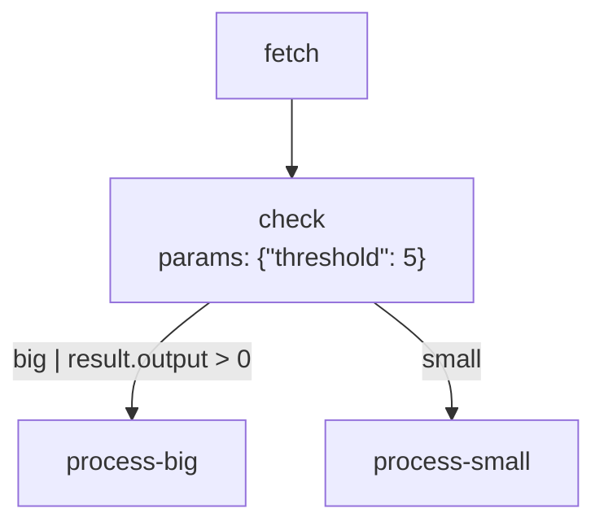

# Visualizing Workflows

Understanding the structure of a complex workflow can be challenging just by reading code or JSON. Flowcraft includes a utility to generate [Mermaid](https://mermaid.js.org/) diagram syntax directly from a [`WorkflowBlueprint`](/api/flow#workflowblueprint-interface).

This makes it easy to visualize, document, and debug your workflows. Flowcraft provides multiple ways to visualize your workflows:

## `generateMermaid`

The [`generateMermaid`](/api/analysis#generatemermaid-blueprint) function takes a blueprint and returns a string of Mermaid flowchart syntax. Node labels include the node ID and, if present, the node's parameters for richer visualization.

```typescript
import { createFlow, generateMermaid } from 'flowcraft'

const flow = createFlow('conditional-workflow')
	.node('fetch', async () => ({ output: { value: 10 } }))
	.node('check', async ({ input }) => ({
		action: input.value > 5 ? 'big' : 'small'
	}), { threshold: 5 })
	.node('process-big', async () => ({}))
	.node('process-small', async () => ({}))
	.edge('fetch', 'check')
	.edge('check', 'process-big', { action: 'big', condition: 'result.output > 0' })
	.edge('check', 'process-small', { action: 'small' })
	.toBlueprint()

const mermaidSyntax = generateMermaid(flow)
console.log(mermaidSyntax)
```

### Rendering the Diagram

The output of [`generateMermaid`](/api/analysis#generatemermaid-blueprint) will be:
```
flowchart TD
	fetch["fetch"]
	check["check<br/>params: {"threshold":5}"]
	process-big["process-big"]
	process-small["process-small"]
	fetch --> check
	check -- "big | result.output > 0" --> process-big
	check -- "small" --> process-small
```

When this syntax is rendered by a tool that supports Mermaid (like this documentation site, GitHub markdown, or the Mermaid Live Editor), you get a clear visual representation of your workflow:

This is particularly useful for building workflow editors, debuggers, or any application that needs to display workflows in a user-friendly graph format.



Notice how the `action` and `condition` from the edges are automatically added as labels to the connections in the diagram.

## `generateMermaidForRun`

For debugging and monitoring, it's often more useful to see the actual execution path of a specific workflow run rather than just the blueprint structure. The [`generateMermaidForRun`](/api/analysis#generatemermaidforrun-blueprint-events) function takes both a blueprint and an array of execution events to generate a Mermaid diagram with visual highlighting of the execution path.

```typescript
import { createFlow, generateMermaidForRun } from 'flowcraft'
import { InMemoryEventLogger } from 'flowcraft/testing'

const flow = createFlow('conditional-workflow')
	.node('fetch', async () => ({ output: { value: 10 } }))
	.node('check', async ({ input }) => ({
		action: input.value > 5 ? 'big' : 'small'
	}), { threshold: 5 })
	.node('process-big', async () => ({}))
	.node('process-small', async () => ({}))
	.edge('fetch', 'check')
	.edge('check', 'process-big', { action: 'big', condition: 'result.output > 0' })
	.edge('check', 'process-small', { action: 'small' })

const blueprint = flow.toBlueprint()

// Run the workflow with event logging
const eventLogger = new InMemoryEventLogger()
const runtime = new FlowRuntime({ eventBus: eventLogger })
await runtime.run(blueprint)

// Generate execution-highlighted diagram
const mermaidSyntax = generateMermaidForRun(blueprint, eventLogger.events)
console.log(mermaidSyntax)
```

### Execution Path Highlighting

The generated diagram visually distinguishes the execution path:

- **Successful nodes** are highlighted in green
- **Failed nodes** are highlighted in red
- **Taken edges** are shown with thicker blue lines

This provides immediate visual diagnostics for any workflow run, making it easy to see which nodes succeeded, which failed, and which path was actually taken through the graph.

## `toGraphRepresentation`

For programmatic visualization in user interfaces, the [`Flow`](/api/flow#flow-class) class provides a [`.toGraphRepresentation()`](/api/flow#tographrepresentation) method that returns a [`UIGraph`](/api/flow#uigraph-interface). This method:

-   Simplifies complex patterns like loops and batches for cleaner UI display
-   Replaces loop controllers with direct cyclical edges
-   Replaces batch scatter/gather pairs with single representative nodes
-   Preserves all essential node and edge information

```typescript
import { createFlow } from 'flowcraft'

const flow = createFlow('my-workflow')
  .node('start', async () => ({}))
  .node('process', async () => ({}))
  .node('end', async () => ({}))
  .edge('start', 'process')
  .edge('process', 'end')
  .loop('my-loop', {
    startNodeId: 'start',
    endNodeId: 'end',
    condition: 'i < 10'
  })
  .batch('my-batch', async () => ({}), { inputKey: 'items', outputKey: 'results' })

const uiGraph = flow.toGraphRepresentation()
// Use uiGraph.nodes and uiGraph.edges to render in your UI
```

***

Visualizing your workflows is an invaluable tool for:
-   **Debugging**: Quickly spot incorrect connections or logic flows.
-   **Documentation**: Automatically generate up-to-date diagrams for your team.
-   **Onboarding**: Help new team members understand the structure of complex processes.
-   **UI Integration**: Build interactive workflow editors and visual debuggers.

Choose [`generateMermaid`](/api/analysis#generatemermaid-blueprint) for static documentation and sharing, or [`toGraphRepresentation`](/api/flow#tographrepresentation) for dynamic, programmatic visualization in your applications.
