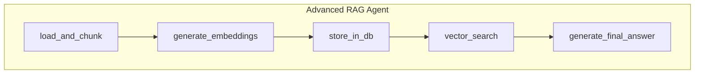

# Advanced RAG Agent Workflow

This workflow demonstrates a complete Retrieval-Augmented Generation (RAG) pipeline. It ingests a document, processes it into a searchable format, retrieves relevant context based on a question, and synthesizes a final answer.

This is a powerful example of a linear, data-processing workflow where each step enriches the `Context` for the subsequent step, culminating in a sophisticated AI-powered response.

## Workflow ID: (Implicit, from file name `rag.json`)

### Description

1. **`load_and_chunk`**: Reads a source document from a file path. It splits the content into smaller, manageable text chunks, creating `DocumentChunk` objects that include metadata like an ID and ingestion timestamp.

2. **`generate_embeddings`**: Takes the document chunks and, using a `ParallelBatchFlow`, calls an embedding API for each chunk concurrently. This efficiently transforms the text into numerical vector representations.

3. **`store_in_db`**: Simulates the process of upserting the chunks and their corresponding embedding vectors into a vector database. The combined data is stored in the `Context` for the next step.

4. **`vector_search`**: Performs the "retrieval" step. It generates an embedding for the user's question, calculates the similarity against all document chunks in the "database", and returns the top `k` most relevant chunks.

5. **`generate_final_answer`**: The final "generation" step. It constructs a prompt containing the user's original question and the retrieved text chunks as context, then asks an LLM to synthesize a comprehensive answer based only on the provided information.

### Visual Graph

