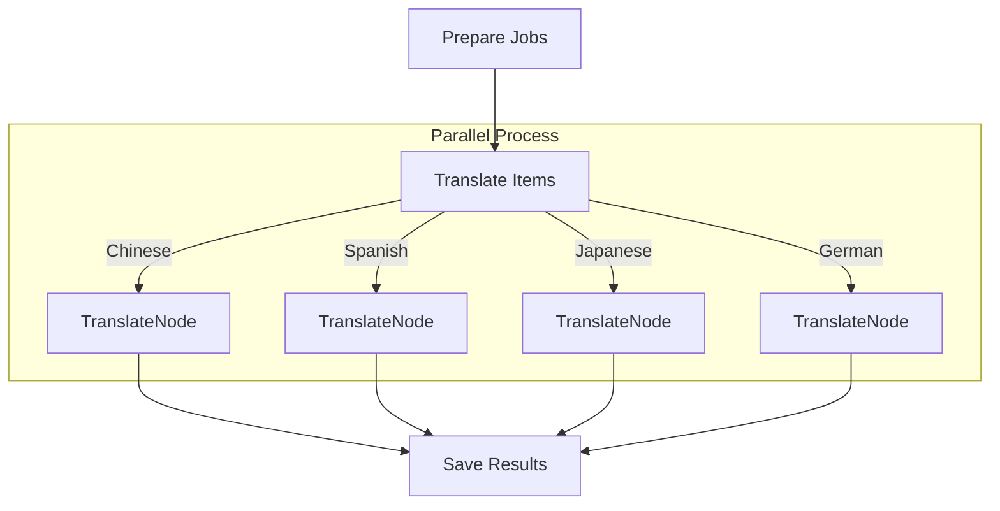

# Parallel Batch Translation

This project demonstrates using `flowcraft`'s `.batch()` helper to translate a document into multiple languages concurrently, showcasing significant performance improvements for I/O-bound tasks.

## Goal

Translate a source `README.md` file into multiple languages (Chinese, Spanish, etc.) in parallel and save each translation to the `translations/` directory.

## How to Run

1.  **Install dependencies**:

    ```bash
    npm install
    ```

2.  **Set your OpenAI API key**:
    Create a `.env` file in this directory:

    ```
    OPENAI_API_KEY="your-api-key-here"
    ```

3.  **Run the translation process**:

    ```bash
    npm start
    ```

## How It Works

The implementation uses the `.batch()` method on the `Flow` builder to process translation requests for all languages at the same time.



1.  **`prepare-jobs` Node**: This first node runs, reads the list of languages from the context, and produces an array of "job" objects (e.g., `[{ language: 'Spanish', text: '...' }, ...]`).
2.  **`.batch()` Helper**: The flow is configured with a batch operation. It is told to read its input from the output of the `prepare-jobs` node. It then executes a special "worker" function (`translateItem`) in parallel for each job in the array.
3.  **`translateItem` Worker**: This function is not a regular node in the graph but the logic for the batch processor. It takes a single job, calls the LLM for translation, and returns the result.
4.  **`save-results` Node**: Once all parallel worker functions are complete, their results are gathered into a single array. This final node takes that array and writes all the translations to the disk.

## Performance Comparison

Running translations in parallel dramatically reduces the total execution time compared to a one-by-one sequential approach.

- **Sequential**: ~60 seconds
- **Parallel (this example)**: ~10 seconds

_(Actual times will vary based on API response speed and system.)_
