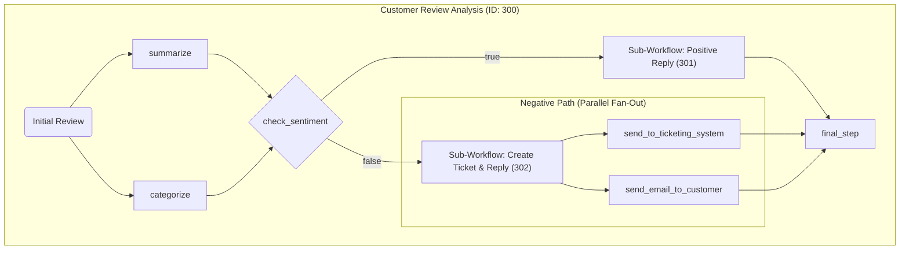
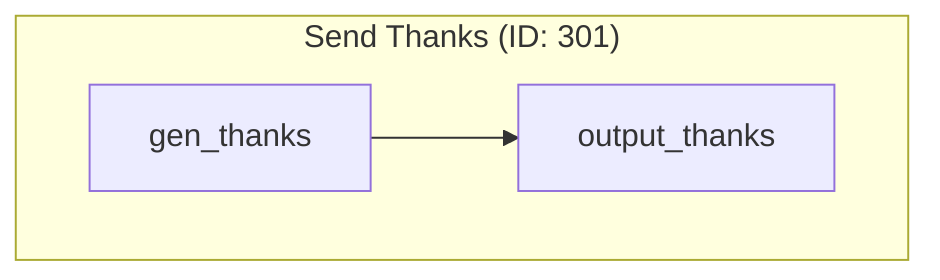
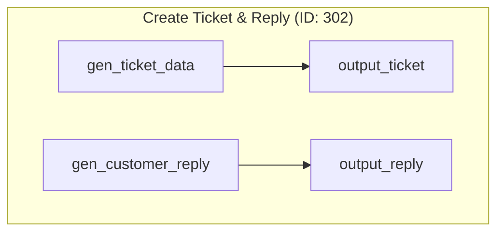

# Use Case 3: Customer Review Analysis

This workflow demonstrates an advanced Directed Acyclic Graph (DAG) that includes parallel processing at the start, conditional branching, and a "fan-out" where a single node triggers multiple parallel downstream tasks.

## Main Workflow ID: 300

### Description

1. **Parallel Analysis**: The flow starts by running two tasks on the `initial_review` in parallel:
    - `summarize`: Creates a one-sentence summary.
    - `categorize`: Classifies the review (e.g., 'Bug Report').
2. **Conditional Check**: The `summary` is passed to `check_sentiment`, which uses an LLM to determine if the review is positive. It returns `true` or `false`. The `category` is also passed along for the negative path.
3. **Branching**:
    - **On `true`**: The flow executes the `positive_branch` (Sub-Workflow 301) to thank the customer.
    - **On `false`**: The flow executes the `negative_branch` (Sub-Workflow 302) to create a support ticket and a customer reply.
4. **Mid-Flow Fan-Out**: The `negative_branch` is a powerful example of fan-out. After it completes, its multiple outputs are used to trigger two separate, parallel actions:
    - `send_to_ticketing_system`
    - `send_email_to_customer`
5. **Convergence**: All paths eventually lead to the `final_step` node, which aggregates the results from whichever branch was executed.

### Visual Graph



---

## Sub-Workflows

### Sub-Workflow ID: 301 (Send Thanks)

A simple workflow to generate a thank-you message for positive feedback.



### Sub-Workflow ID: 302 (Create Ticket and Reply)

This sub-workflow itself runs tasks in parallel. It generates the data for a support ticket and a customer-facing reply simultaneously. These outputs are then passed back to the main flow to be used in the parallel fan-out step.



```
