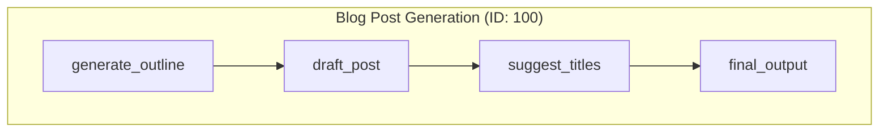
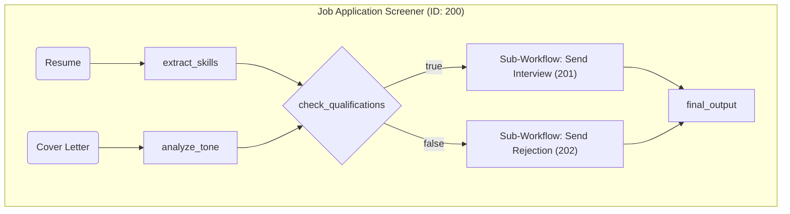
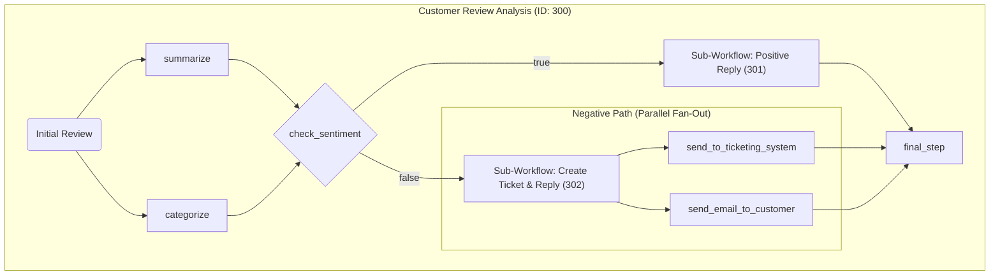
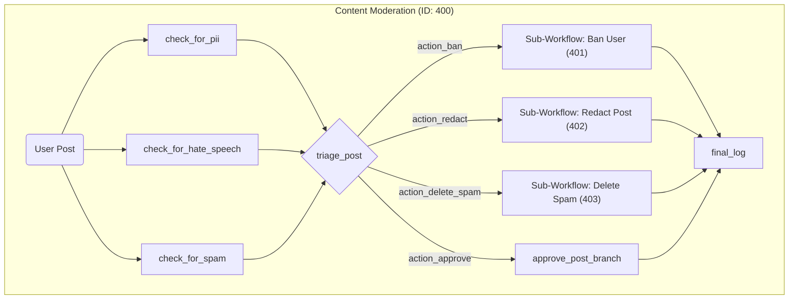

# Declarative AI Agent - Shared Logic

This package contains the core business logic, workflow definitions (blueprints), and node implementations for a declarative AI agent. It is designed to be a reusable library consumed by different execution environments, such as an in-memory runtime or a distributed worker system.

This package **is not runnable on its own**. It is used by the following examples:
*   **[5a_declarative-in-memory](../5a_declarative-in-memory/):** Demonstrates executing these workflows with the standard, in-memory `FlowRuntime`.
*   **[5b_declarative-distributed](../5b_declarative-distributed/):** Demonstrates executing the same workflows in a distributed environment using the `BullMQAdapter`.

## Features of the Agent Logic

- **File-Based Workflow Definitions**: Complex workflows are defined as simple JSON files, decoupling the agent's logic from the execution code.
- **LLM-Powered Generic Nodes**: A small set of powerful, reusable nodes provides the core logic:
  - `llm-process`: For content generation, summarization, and data extraction.
  - `llm-condition`: For natural language-based conditional branching (`true`/`false`).
  - `llm-router`: For dynamic, multi-way branching based on an LLM's decision.
- **Composable & Nested Workflows**: The `subflow` node allows workflows to embed and reuse other workflows, promoting modularity.
- **Enhanced DAG Support**: The workflow designs include parallel start points and mid-flow "fan-out," where a single condition can trigger multiple independent paths to run concurrently.

## What This Package Provides

-   `data/`: A collection of JSON-based `WorkflowBlueprint` definitions for various use cases.
-   `src/nodes.ts`: The reusable, generic node function implementations (`llm-process`, `llm-router`, etc.).
-   `src/registry.ts`: The `NodeRegistry` that maps the `uses` key from the JSON blueprints to the actual node functions.
-   `src/config.ts`: Pre-configured initial context data for each use case.
-   `src/utils.ts`: Helper functions for interacting with the LLM.

## Example Use-Cases

The `data` directory contains several examples, each demonstrating different capabilities of the agent.

### Use-Case 1: Blog Post Generation (Sequential Flow)

A classic linear workflow for content creation, where the output of one step becomes the input for the next.

**Demonstrates**:
- **Sequential Processing**: A simple, powerful chain of nodes.
- **Content Generation Pipeline**: A common pattern for AI-powered content creation.
- **For more details, see [`data/1.blog-post/README.md`](./data/1.blog-post/README.md).**

### Use-Case 2: Job Applicant Screener (DAG with Conditional Branching)

A workflow that analyzes a resume and cover letter in parallel, then makes a decision to call one of two sub-workflows.

**Demonstrates**:
- **Parallel Inputs**: Processing multiple independent data sources concurrently.
- **Conditional Branching**: Using an `llm-condition` node to direct the flow.
- **Sub-Workflows**: Composing flows by calling other, reusable workflows.
- **For more details, see [`data/2.job-application/README.md`](./data/2.job-application/README.md).**

### Use-Case 3: Customer Review Analysis (DAG with Fan-Out)

An advanced workflow that runs initial processing in parallel, makes a conditional decision, and then demonstrates a **mid-flow fan-out**, where one node triggers multiple parallel downstream actions.

**Demonstrates**:
- **Mid-Flow Fan-Out**: A single node triggers multiple concurrent downstream tasks.
- **Complex Sub-Workflows**: The sub-workflows themselves can have parallel steps.
- **Data Aggregation**: A final node gathers results from multiple, mutually exclusive branches.
- **For more details, see [`data/3.customer-review/README.md`](./data/3.customer-review/README.md).**

### Use-Case 4: Content Moderation (Router Pattern)

A sophisticated workflow that performs multiple parallel checks on content and then uses a central **router** node to decide on one of several possible actions.

**Demonstrates**:
- **LLM-Powered Routing**: Using the `llm-router` node to implement a dynamic `switch` statement.
- **Multi-Way Branching**: Directing the flow to one of many distinct paths.
- **For more details, see [`data/4.content-moderation/README.md`](./data/4.content-moderation/README.md).**
