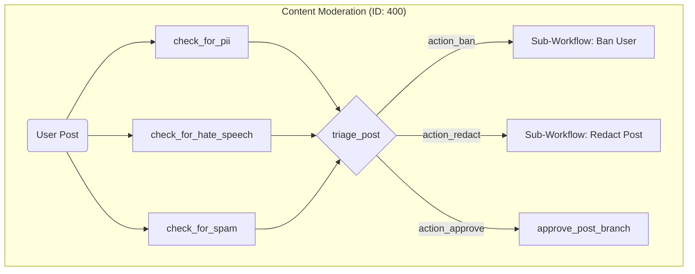

# Data-Driven Workflows

While Flowcraft's fluent `.node()` and `.edge()` API is great for defining workflows in code, one of the framework's most powerful features is its ability to execute workflows from **serializable JSON objects** (the `WorkflowBlueprint`).

This decouples your business logic from the workflow's structure, enabling you to:

-   Build visual drag-and-drop workflow editors.
-   Allow non-developers to configure or modify business processes.
-   Store workflow definitions in a database.
-   Dynamically generate and execute workflows in AI agent systems.

## Registry + Blueprint + Runtime

The core pattern involves three components:

1.  **Node Registry**: A central map where you register your reusable node functions (e.g., `llm-process`, `send-email`) under a simple string key.
2.  **Workflow Blueprint**: A JSON file that defines the nodes and edges, referencing the node implementations by their string keys.
3.  **FlowRuntime**: The engine, configured with the registry, that can load and execute any blueprint.

## Example: Content Moderation

The **[Dynamic AI Agent example](/examples/4a_declarative-in-memory)** demonstrates this perfectly. The entire moderation logic is defined in [`400.json`](https://github.com/gorango/flowcraft/tree/master/examples/5.declarative-shared-logic/data/4.content-moderation/400.json).



A node in the JSON looks like this:

```json
{
  "id": "check_for_pii",
  "uses": "llm-condition", // Key from our Node Registry
  "data": {
    "promptTemplate": "Does this text contain PII? Respond 'true' or 'false'.\n\nText: \"{{userPost}}\"",
    "inputs": {
      "userPost": "userPost" // Read 'userPost' from the context
    }
  }
}
```

The runtime dynamically constructs and executes this graph. This approach means you can add a new moderation rule (e.g., `check_for_profanity`) by simply adding a new node to the JSON and a new edge to the `triage_post` router, with **no changes to the application code**.

> [!TIP]
> This data-driven approach is the key to building scalable and maintainable systems. When you separate the "what" (the JSON graph) from the "how" (the node implementations), your system becomes incredibly flexible.
