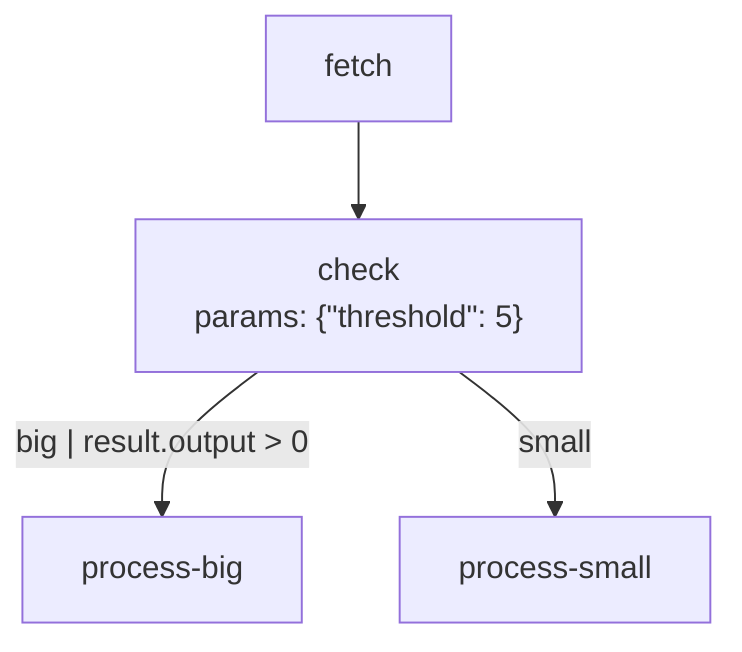

# Visualizing Workflows

Generate diagrams from workflow blueprints for documentation, debugging, and UI integration.

## generateMermaid

Generates Mermaid flowchart syntax from a blueprint:

```typescript
import { createFlow, generateMermaid } from 'flowcraft'

const flow = createFlow('conditional-workflow')
	.node('fetch', async () => ({ output: { value: 10 } }))
	.node(
		'check',
		async ({ input }) => ({
			action: input.value > 5 ? 'big' : 'small',
		}),
		{ threshold: 5 },
	)
	.node('process-big', async () => ({}))
	.node('process-small', async () => ({}))
	.edge('fetch', 'check')
	.edge('check', 'process-big', { action: 'big', condition: 'result.output > 0' })
	.edge('check', 'process-small', { action: 'small' })
	.toBlueprint()

const mermaidSyntax = generateMermaid(flow)
```

### Output



Node labels include the node ID and parameters. Edge labels show `action` and `condition`.

## generateMermaidForRun

Generates a Mermaid diagram with execution path highlighting from actual run events:

```typescript
import { createFlow, generateMermaidForRun } from 'flowcraft'
import { InMemoryEventLogger } from 'flowcraft/testing'

const flow = createFlow('my-flow')
	.node('fetch', async () => ({ output: { value: 10 } }))
	.node('check', async ({ input }) => ({
		action: input.value > 5 ? 'big' : 'small',
	}))
	.node('process-big', async () => ({}))
	.node('process-small', async () => ({}))
	.edge('fetch', 'check')
	.edge('check', 'process-big', { action: 'big' })
	.edge('check', 'process-small', { action: 'small' })

const blueprint = flow.toBlueprint()

const eventLogger = new InMemoryEventLogger()
const runtime = new FlowRuntime({ eventBus: eventLogger })
await runtime.run(blueprint)

const mermaidSyntax = generateMermaidForRun(blueprint, eventLogger.events)
```

### Execution Path Highlighting

| Visual Cue       | Meaning                                |
| ---------------- | -------------------------------------- |
| Green nodes      | Successfully completed                 |
| Red nodes        | Failed                                 |
| Thick blue edges | Edges that were taken during execution |

## toGraphRepresentation

Returns a `UIGraph` object for programmatic visualization in user interfaces:

```typescript
import { createFlow } from 'flowcraft'

const flow = createFlow('my-workflow')
	.node('start', async () => ({}))
	.node('process', async () => ({}))
	.node('end', async () => ({}))
	.edge('start', 'process')
	.edge('process', 'end')
	.loop('my-loop', {
		startNodeId: 'start',
		endNodeId: 'end',
		condition: 'i < 10',
	})
	.batch('my-batch', async () => ({}), { inputKey: 'items', outputKey: 'results' })

const uiGraph = flow.toGraphRepresentation()
// Use uiGraph.nodes and uiGraph.edges to render in your UI
```

### Simplification

`toGraphRepresentation()` simplifies complex patterns for cleaner UI display:

- **Loops**: Replaces loop controllers with direct cyclical edges
- **Batches**: Replaces scatter/gather pairs with single representative nodes
- **Preserves**: All essential node and edge information

## Use Cases

| Scenario                  | Tool                      |
| ------------------------- | ------------------------- |
| Static documentation      | `generateMermaid()`       |
| Debugging a specific run  | `generateMermaidForRun()` |
| Building workflow editors | `toGraphRepresentation()` |
| Team onboarding           | `generateMermaid()`       |
