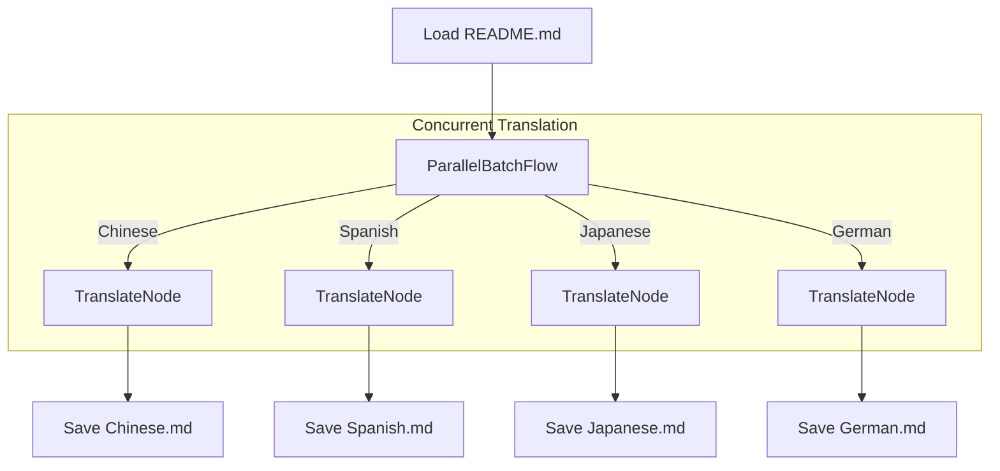

# Parallel Batch Translation

This project demonstrates using `workflow`'s `AsyncParallelBatchFlow` to translate a document into multiple languages concurrently, showcasing significant performance improvements for I/O-bound tasks.

## Goal

Translate a source `README.md` file into multiple languages (Chinese, Spanish, etc.) in parallel and save each translation to the `translations/` directory.

## How to Run

1. **Install dependencies**:

    ```bash
    npm install
    ```

2. **Set your OpenAI API key**:
    Create a `.env` file in this directory:

    ```
    OPENAI_API_KEY="your-api-key-here"
    ```

3. **Run the translation process**:

    ```bash
    npm start
    ```

## How It Works

The implementation uses an `AsyncParallelBatchFlow` to process translation requests for all languages at the same time.



1. **`TranslateFlow` (extends `AsyncParallelBatchFlow`)**: The `prepAsync` method prepares a list of parameters, one for each language.

    ```typescript
    // prepAsync returns: [{ language: 'Chinese' }, { language: 'Spanish' }, ...]
    ```

2. **`TranslateNode` (extends `AsyncNode`)**: This node is executed in parallel for each set of parameters. Its `execAsync` method calls the LLM for a single translation.
3. **File I/O**: The results are written to disk asynchronously.

## Performance Comparison

Running translations in parallel dramatically reduces the total execution time compared to a one-by-one sequential approach.

- **Sequential**: ~60 seconds
- **Parallel (this example)**: ~10 seconds

*(Actual times will vary based on API response speed and system.)*
