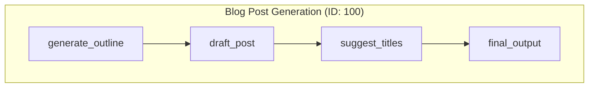
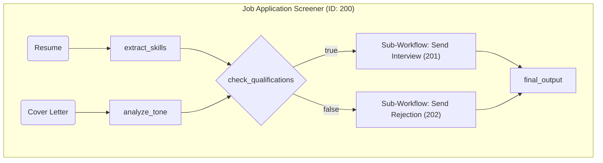
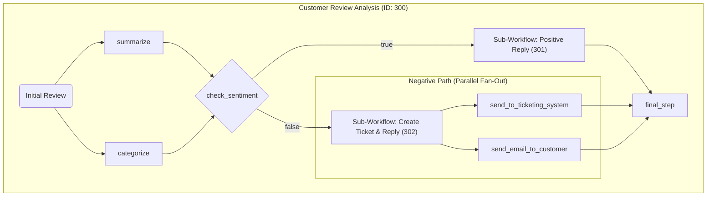
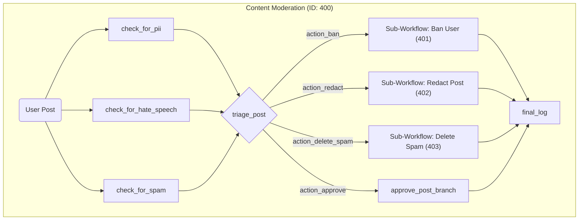

# Dynamic AI Agent from Visual Graphs

This example demonstrates a runtime engine that can execute complex, graph-based AI workflows defined as simple JSON files. It showcases how to build a powerful AI agent that can reason, branch, and call other workflows recursively using the `workflow` framework.

The system is designed to be highly modular, allowing you to define different use-cases (e.g., customer support, content creation, HR) by simply adding new workflow graphs, without changing the core application code.

## Features

- **File-Based Workflow Definitions**: Define complex workflows as simple JSON files. This decouples the logic from the code, allowing for easy creation, modification, and management of flows.
- **Enhanced DAG Support**: The engine automatically detects both parallel start points and **parallel branching from any node in the graph (fan-out)**. This allows for complex, non-linear workflows where a single condition can trigger multiple independent paths to run concurrently.
- **LLM-Powered Logic**: Utilizes generic, reusable nodes that call a Large Language Model (LLM) for sophisticated tasks:
  - `llm-process`: For content generation, summarization, and data extraction.
  - `llm-condition`: For natural language-based conditional branching (`true`/`false`).
  - `llm-router`: For dynamic, multi-way branching based on an LLM's decision.
- **Composable & Nested Workflows**: A `sub-workflow` node allows you to embed and reuse entire workflows within others, promoting modularity and DRY principles.
- **Robust Data Handling**: The framework seamlessly passes data between nodes and even across sub-workflow boundaries. It includes a pattern for safely aggregating outputs from different conditional branches.
- **Dynamic & Scalable**: A `WorkflowRegistry` dynamically loads all workflow definitions from a specified use-case directory on startup, making it easy to add or switch between different applications.

## How to Run

1. **Install dependencies**:

    ```bash
    npm install
    ```

2. **Set your OpenAI API key**:
    Create a `.env` file in this project's root directory:

    ```
    OPENAI_API_KEY="your-api-key-here"
    ```

3. **Choose a Use-Case**:
    Open `src/main.ts` and configure the `ACTIVE_USE_CASE` constant at the top of the file to select which example to run.

    ```typescript
    // src/main.ts
    // --- CONFIGURATION ---
    // Change this value to run different use-cases.
    const ACTIVE_USE_CASE: UseCase = '1.blog-post'
    // const ACTIVE_USE_CASE: UseCase = '2.job-application'
    // const ACTIVE_USE_CASE: UseCase = '3.customer-review'
    // const ACTIVE_USE_CASE: UseCase = '4.content-moderation'
    ```

4. **Run the application**:

    ```bash
    npm start
    ```

## How It Works

This example uses a `Registry -> Builder -> Executor` pattern to run workflows defined in the `data/` directory.

1. **Workflow Definitions**: Workflows are defined as JSON files within a use-case-specific subdirectory (e.g., `data/customer-review/`). Each file is named with its ID (e.g., `300.json`) and contains a list of nodes and edges. Each subdirectory also contains a `README.md` with detailed information.

2. **`WorkflowRegistry`**: On startup, the registry is initialized for a specific use-case directory. It reads all `.json` files, parses them into `WorkflowGraph` objects, and stores them in memory.

3. **`FlowBuilder`**: When a flow is requested, the builder translates the declarative graph data (nodes and edges) into a connected graph of executable `Node` instances. It intelligently handles parallelism in two ways:
    1. It wraps multiple start nodes in a `ParallelNode` for an initial fan-out.
    2. More powerfully, if it detects that a single node's action (e.g., `'true'`) connects to multiple downstream nodes, it **dynamically inserts another `ParallelNode` to execute that branch concurrently**.

4. **Generic Executor Nodes**: A small set of powerful, reusable nodes in `src/nodes.ts` provide the runtime logic. These nodes are configured entirely by the `data` field in the JSON definition, making them highly flexible.

## Example Use-Cases

The `data` directory contains several examples, each demonstrating different capabilities of the framework.

### Use-Case 1: Blog Post Generation (Sequential Flow)

A classic linear workflow for content creation, where the output of one step becomes the input for the next.



**Demonstrates**:
- **Sequential Processing**: A simple, powerful chain of nodes.
- **Content Generation Pipeline**: A common pattern for AI-powered content creation.
- **For more details, see [`data/1.blog-post/README.md`](./data/1.blog-post/README.md).**

### Use-Case 2: Job Applicant Screener (DAG with Conditional Branching)

A workflow that analyzes a resume and cover letter in parallel, then makes a decision to call one of two sub-workflows.



**Demonstrates**:
- **Parallel Inputs**: Processing multiple independent data sources concurrently.
- **Conditional Branching**: Using an `llm-condition` node to direct the flow.
- **Sub-Workflows**: Composing flows by calling other, reusable workflows.
- **For more details, see [`data/2.job-application/README.md`](./data/2.job-application/README.md).**

### Use-Case 3: Customer Review Analysis (DAG with Fan-Out)

An advanced workflow that runs initial processing in parallel, makes a conditional decision, and then demonstrates a **mid-flow fan-out**, where one node triggers multiple parallel downstream actions.



**Demonstrates**:
- **Mid-Flow Fan-Out**: A single node (`negative_branch`) triggers multiple concurrent downstream tasks.
- **Complex Sub-Workflows**: The sub-workflows themselves can have parallel steps.
- **Data Aggregation**: A final node gathers results from multiple, mutually exclusive branches.
- **For more details, see [`data/3.customer-review/README.md`](./data/3.customer-review/README.md).**

### Use-Case 4: Content Moderation (Router Pattern)

A sophisticated workflow that performs multiple parallel checks on content and then uses a central **router** node to decide on one of several possible actions.



**Demonstrates**:
- **LLM-Powered Routing**: Using the `llm-router` node to implement a dynamic `switch` statement based on multiple inputs.
- **Multi-Way Branching**: Directing the flow to one of many distinct paths.
- **Scalable Moderation Logic**: New moderation rules or actions can be added by modifying the graph and prompts, not the core code.
- **For more details, see [`data/4.content-moderation/README.md`](./data/4.content-moderation/README.md).**
