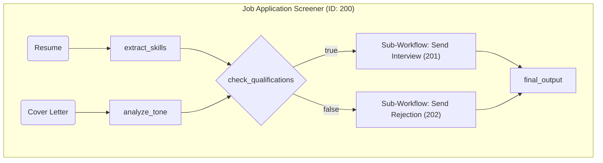
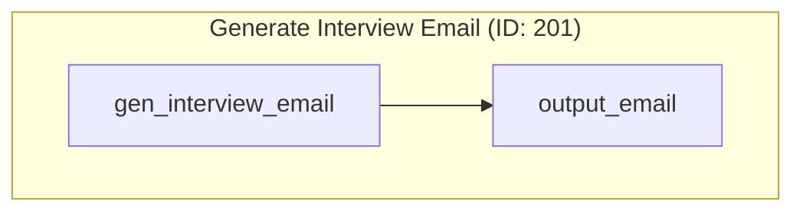
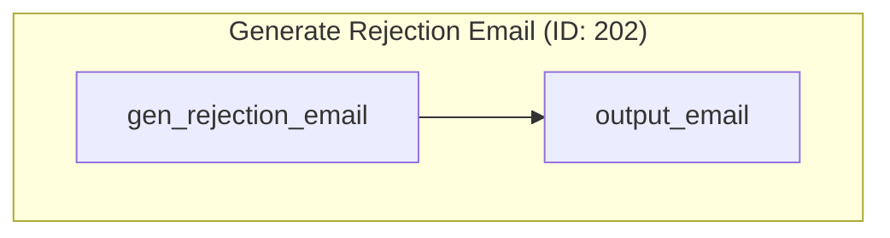

# Use Case 2: Job Application Screener

This workflow demonstrates a more complex Directed Acyclic Graph (DAG) for screening a job applicant. It showcases parallel processing, data convergence, and conditional branching based on an LLM's evaluation.

## Main Workflow ID: 200

### Description

1. **Parallel Analysis**: The flow begins by analyzing the applicant's `resume` and `coverLetter` simultaneously.
    - `extract_skills`: Pulls a list of technical skills from the resume.
    - `analyze_tone`: Determines the professionalism of the cover letter.
2. **Conditional Check**: The results from the parallel steps are fed into the `check_qualifications` node. This LLM-powered node evaluates if the applicant meets the required criteria (e.g., has specific skills and a professional tone). It returns `true` or `false`.
3. **Branching**: Based on the result of the check, the flow executes one of two sub-workflows:
    - **On `true`**: It calls the `Send Interview Email` sub-workflow (ID: 201).
    - **On `false`**: It calls the `Send Rejection Email` sub-workflow (ID: 202).
4. **Convergence**: The output from whichever branch was executed is passed to the `final_output` node, which formats the concluding message.

### Visual Graph

---

## Sub-Workflows

### Sub-Workflow ID: 201 (Send Interview Email)

A simple, linear workflow that generates a polite email inviting the candidate to an interview.

### Sub-Workflow ID: 202 (Send Rejection Email)

A simple, linear workflow that generates a polite rejection email.

