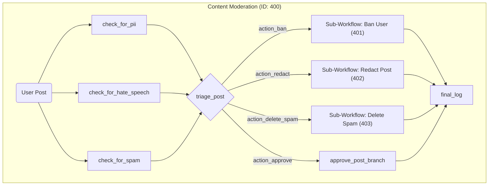
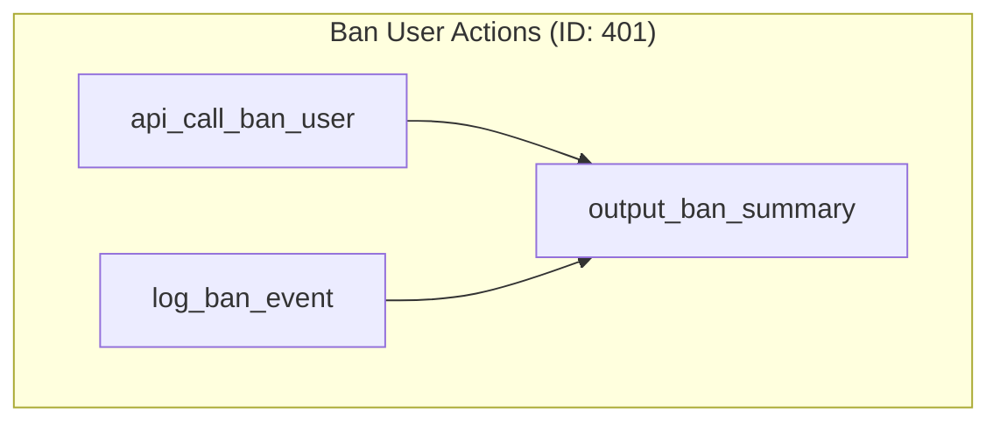
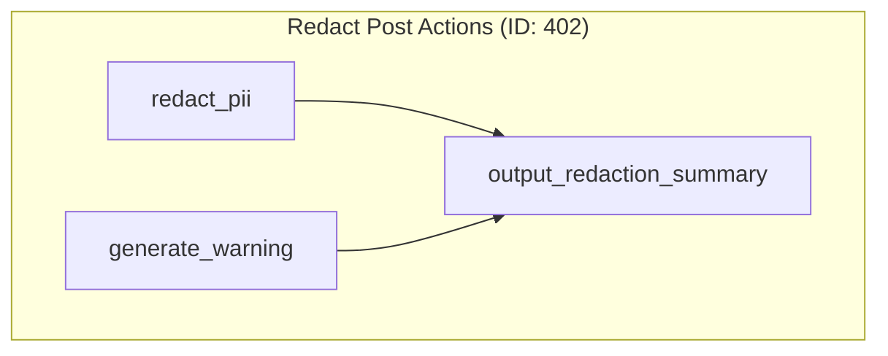
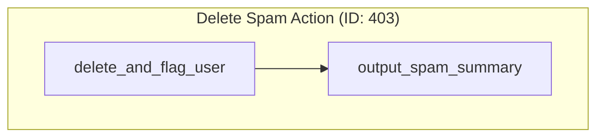

# Use Case 4: Content Moderation

This workflow demonstrates a sophisticated "router" pattern. It performs multiple parallel analyses on a piece of content and then uses a central LLM-powered router node to decide which of several distinct moderation actions to take.

## Main Workflow ID: 400

### Description

1. **Parallel Analysis**: The workflow begins by performing three independent checks on the `userPost` in parallel:
    - `check_for_pii`: Looks for Personally Identifiable Information.
    - `check_for_hate_speech`: Analyzes the severity of any hate speech.
    - `check_for_spam`: Detects if the post is commercial spam.
2. **Router Node**: All three analysis results are fed into the `triage_post` node. This special `llm-router` node uses an LLM to evaluate the combined inputs against a set of rules and returns a single action string (e.g., `action_ban`, `action_redact`).
3. **Multi-Way Branching**: The action string from the router determines which of the four possible paths is executed.
    - `action_ban` -> Sub-Workflow 401 (Ban User)
    - `action_redact` -> Sub-Workflow 402 (Redact Post)
    - `action_delete_spam` -> Sub-Workflow 403 (Delete Spam)
    - `action_approve` -> A simple node to log the approval.
4. **Convergence**: The result from the chosen moderation path is captured in the `final_log` node.

### Visual Graph

---

## Sub-Workflows

### Sub-Workflow ID: 401 (Ban User)

This workflow simulates banning a user by performing a database update and creating a security log entry in parallel.

### Sub-Workflow ID: 402 (Redact Post)

This workflow redacts PII from the user's post and generates a warning message for the user, with both actions running in parallel.

### Sub-Workflow ID: 403 (Delete Spam)

A simple, linear workflow that simulates deleting a spam post and flagging the user.

