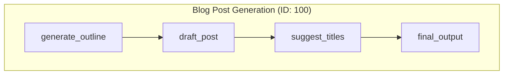

# Use Case 1: Blog Post Generation

This workflow demonstrates a simple, linear pipeline for content creation. It takes an initial topic and sequentially processes it through a series of steps to produce a finished blog post with title suggestions.

This is a classic example of how to chain nodes together to form a multi-step, sequential process where the output of one node becomes the input for the next.

## Workflow ID: 100

### Description

1. **`generate_outline`**: Takes the initial `topic` and uses an LLM to generate a blog post outline.
2. **`draft_post`**: Uses the generated outline to write a full-length blog post.
3. **`suggest_titles`**: Analyzes the drafted post to suggest several catchy, SEO-friendly titles.
4. **`final_output`**: Combines the suggested titles and the final draft into a single output string for review.

### Visual Graph

