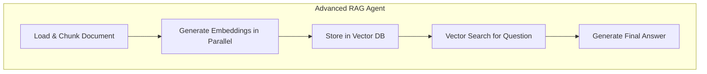

# Advanced RAG Agent with Document Analysis

This example demonstrates a sophisticated Retrieval-Augmented Generation (RAG) agent built with Flowcraft. The workflow ingests and analyzes a document, uses embeddings to find relevant information, and generates a precise answer to a user's question.

This project serves two main purposes:

1. To provide a practical, real-world example of a complex, multi-step AI workflow.
2. To illustrate the importance of robust state serialization (`superjson`) when passing complex data structures (like `Map`, `Date`, and custom class instances) through a workflow's `Context`.

## Features

- **RAG Pipeline**: Implements a full RAG pipeline: document loading, chunking, embedding generation, vector search, and final answer synthesis.
- **Complex Data Structures**: The workflow creates and manages `Map` objects, `Date` objects, and custom `DocumentChunk` and `SearchResult` class instances.
- **Robust Serialization**: At the end of the workflow, it demonstrates how `superjson` can correctly serialize the entire final context, preserving all complex data types that would be lost with `JSON.stringify`.
- **Declarative & Modular**: The entire workflow is defined in a single `rag.json` file, and the logic is broken down into reusable, single-responsibility nodes.

## How to Run

1. **Install dependencies**:

    ```bash
    npm install
    ```

2. **Set your OpenAI API key**:
    Create a `.env` file in this project's root directory:

    ```
    OPENAI_API_KEY="your-api-key-here"
    ```

3. **Run the application**:

    ```bash
    npm start
    ```

    The application will process the `documents/sample-flowcraft.txt` file and answer a hard-coded question. You can change the question in `src/main.ts`.

## How It Works

The workflow is defined in `data/rag.json` and executed by the `InMemoryExecutor`.



1. **`LoadAndChunkNode`**: Reads the source document and splits it into smaller text chunks, creating `DocumentChunk` class instances which include an `ingestedAt: Date`.
2. **`GenerateEmbeddingsNode`**: A `ParallelBatchFlow` that concurrently generates a vector embedding for each document chunk.
3. **`StoreInVectorDBNode`**: Simulates storing the chunks and their embeddings in a vector database (represented as a `Map` in the context).
4. **`VectorSearchNode`**: Takes a user's question, generates an embedding for it, and performs a cosine similarity search to find the most relevant chunks from the "database".
5. **`LLMProcessNode`**: Takes the original question and the retrieved chunks (the "context") and passes them to an LLM to generate a final, synthesized answer.

At the conclusion, `main.ts` prints the final answer and then logs the entire `Context` object, serialized with `superjson`, to show that all the rich data types were preserved throughout the workflow's execution.
